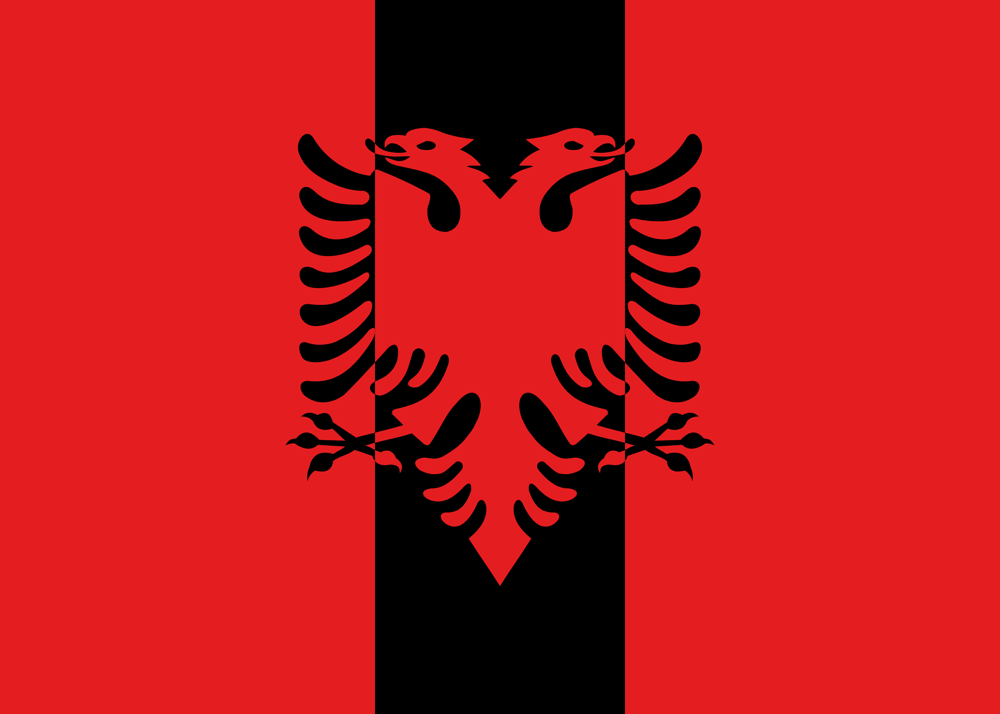

# Flamuri i Bashkimit – Entwurf einer gemeinsamen Flagge Albanien/Kosovo

Konzeptentwurf, kein amtliches Hoheitszeichen.

## Idee

Zwei rote Felder, dazwischen ein schwarzes Band, darüber der albanische Doppeladler im Farbwechsel:
auf dem Band rot, auf den roten Feldern schwarz. Die Flagge ist vollständig spiegelsymmetrisch
und nutzt nur die beiden Farben Albaniens.

## Dateien

| Datei | Zweck |
|---|---|
| `flagge.svg` | Vektor-Master aus genau zwei Flächen (rotes Feld, schwarze Form) – druck- und fahnentauglich |
| `flagge.png` | 2800 × 2000 px |
| `spezifikation.png` | Präsentationsblatt mit Konstruktion, Farben, Symbolik, Fernwirkung |

## Konstruktion

| Maß | Wert |
|---|---|
| Seitenverhältnis | 5 : 7 (wie Albanien) |
| Senkrechte Streifen | Rot – Schwarz – Rot im Verhältnis 3 : 2 : 3 |
| Adler | Höhe ≈ 0,64 H, zentriert auf beiden Achsen |
| Farbwechsel | Die Flügelansätze des Adlers liegen exakt auf den Streifenkanten |

Der Farbwechsel ist als echte Vektorgeometrie ausgeführt (schwarze Fläche = Band XOR Adler),
nicht über Masken oder Clipping. Dadurch entstehen an den Kanten keine Haarlinien, egal in welcher Größe.

## Farben

| Farbe | HEX | RGB |
|---|---|---|
| Rot | `#E41E20` | 228 · 30 · 32 |
| Schwarz | `#000000` | 0 · 0 · 0 |

## Symbolik

- **Zwei rote Felder** – Albanien und Kosovo
- **Schwarzes Band** – was beide verbindet
- **Ein Adler** – ein Körper, je ein Flügel über jedem Feld

## Quellen

Adler-Vektor aus [flag-icons](https://github.com/lipis/flag-icons) (MIT-Lizenz).
